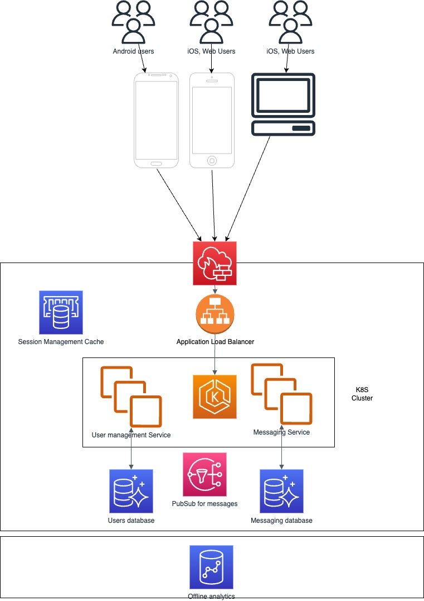

# Current Situation

## Current products

Company A has iOS + Web clients + their back-end

Company B has Android clients + their back-end

## Future load

100X increase and growth of users and traffic over the next 3 years

## Identified problems

- Cannot send message from company A to company B
- Not the same users and not the same data model
- Increase of outages
- Dropped messages
- High user perceived latency (this need to be quantified)
- No cross platform communication

## The solution we are looking for

- Provide near term solution to address service outage and increased latency
- Longer term solution to enable cross platform messaging, this solution should leverage:
  - Cloud based service architecture that would allow multiple divisions of the company to leverage messaging system

## Assumptions

- The team is fully loaded (what do we mean by fully loaded) but have the ability to obtain resources.
- System is overloaded (latency and errors)
- The systems are not on the cloud, they are either on premise or hosted.
- The team is available but we should be careful staffing
- Compose a team with experts from company A and company B and work with them to constitute and core team
- We want to keep company A datamodel if better and also because we have two platforms already done.
- We want to reduce UI components rewrites
- The features of both systems overlap
- The current implementation of the back-end is a monolith for both

# Assessment and approach (1)

## Priorities and timelines

1- Fix service outages: 
 - Increase Observability, latency metrics, improve logs when there are errors
 - Focus on bugs that consume most of the error budget
 - Measure latency metrics (CPU, memory, network, Database, caching) before and after fixes
 - Vertical scalling: Increase CPU, memory, SSD drives.
 - Have multiple instances of the servers running and put them behind a Load Balancer (nginx as an example)
 - Read/write replicas for the DB
 - Increase unit test coverage for each bug fixed (if necessary)

2- Communication between the two platforms
 - Move servers into a Cloud Provider (AWS for example)
 - Proxy that adapts the data between the two systems with minimum functionality
 - Data migration (users, messages)
 - Change Android client to communicate with company A back-end in their formats
 - Reduce feature gap

3- Cloud based architecture
 - Containerise the application
 - Use K8S or AWS ECS as container orchestration and autoscalling
 - Multiregion redundancy
 - 99.9% availability (target)
 - Microservice and event driven architecture

# Day to day priorities (2)

- We have to make sure that established priorities are respected
- We need to identify all issues that we are facing and make sure that we solve the right problem at the right moment
- Do we need more help
- Daily stand up and prioritization meeting
- Weekly feedback to management and retroaction feedback
- Provide project status and demonstrate progress (data before and after)

# Architecture (3)

## Evolution of the architecture

- Make the smallest steps possible toward the goal architecture
- Always maintain a continuation of the service
- Fix current problems and leverage horizontale scalling capabilities
- Introduce a proxy that can act as a translator between the two systems
- Data migration plan, replicate and adapt data from company B to fit in company A data model (use AWS DMS)
- Write an Android http client to interact with company A back-end
- Make Android use the same back-end and data model as iOS Web, feature flag to toggle between back-ends in case of problems
- Split the monolith into Microservices and leverage cloud provider services

# Engineering excellence (4)

## Architecture design patterns

We will move toward a Domain Driven Architecture, using Microservices for processing requests and data manipulation.

We will use event driven compute as well to notify and process incoming and outgoing messages.

## Engineering excellence criteria

### Quality

Unit tests cover 70 to 80% of the code bases.
Integration tests cover all API endpoints or input/output testing (Asynch service).
End to End test cover all user flows and are documented and maintained.
Regression tests run at every deployment on the Green and Blue stack.
Quality Dashboard is setup for each service.

### System Availability

SLA Definition (Uptime 99.9%, request time) 
SLO List and definition
Dashboard with each SLIs and have an aggregation of general service availability
Error budget consumption

### Security

Third party Libraries scanning is setup
Process to resolve to fix faulty dependencies is followed (3 days for critical fix, 7 days for medium, 30 days for minor fix)
No secret is stored in Git
Secret storage is setup per environment
Secrets are rotated every quarter
Penetration tests are done quarterly
Penetration tests vulnerabilities are fixed in a timely manner (Critical is a P1, High 7 days, Medium 30 days, Low 90 days)

### Automated Deployments

All repos have a CI (Continuous Integration) pipeline
We have a CD (Continuous Delivery) pipeline
We are able to deploy a specific branch in a temporary environment for feature testing
Main branch always creates or deploys an artifact
We promote artifacts from main branch to higher environment (no new builds)
Our deployments are done without interruption (Blue/Green)
We support Multi-region deployments (in the future)
All production deployments are logged in Zendesk
Turn off monitoring when deploying a new version to avoid false alerts
Dashboard for DORA metrics

### Observability

All services are logging to Datadog per environment
All logs with error level should have alerts in Datadog and should be prioritized (P1, P2, P3) for paging
All services must have distributed tracing setup
Setup custom metrics for Asynchronous services (StatsD, Prometheus, Grafana)
Dashboard for Load Balancer metrics for all REST end points of the service
Dashboard for Custom Metrics metrics

### Documentation

All repository have a README file
README contains how to run the service locally and on lower environments
README contains how to build the service
All repositories have a Github template for pull requests
Service and library owners are identified in README
All API end points are documented following OpenAPI standards
All the code is documented with JSDoc
All Architecture documentation is updated and maintained per service
All user journeys are documented and updated
All configurations are documented
Service Run book is updated and maintained

# Ensure alignement (5)

- Current feature analysis and differences between the two apps
- Roadmap of the product
- is the new architecture flexible enough? Decoupled and scallable

# Risks (6)

- Data models too complex
- Android application has very bad code structure, hard to decouple and update
- Features of both platforms do not overlap, we may lose some features at the beginning until we re-implment them in the new system
- The current bugs and failures cannot be solved easily and require re-architecture, we may have to live with bugs until we build new platform
- Users migration and authentication/authorization scheme do not match
- If we use two back-ends how to have a central point for authentication
- Could costs when we start scalling, Multi-region (at least 2), CDN (assets),  

# Team delivery (7)

- Focus on engineering excellence criteria
- Be present in stand ups and meeting to ensure alignement or use scrum of scrum for that
- The test pyramyde!!! Increase unit test, have good integration test, make sure that all user journeys are tested and run them in all build pipeline.
- Performance tests run in Pipeline
- API contract testing (OpenAPI standards)
- Distributed tracing with OpenTelemetry and XRay
- CI/CD, feature flags...etc.
- Be very active in design review and code reviews
- Make sure the team have a clear understanding of success criterias
- Put in place monitoring of SLA, SLI and SLO for the system to keep track of quality of the service
- Work with DevOps to have a very good local development setup to enable devs to have the full system on their machine or pieces of it (docker-compose, k8s)
- Have a close colaboration with all senior engineers and staff engineers to make sure that road blocks are identifier and addressed according to the plan
- Communicate advancement and setbacks to the dev team and explain consequences on the project and timeline
- Simple solutions are the best
- DRY principal
- Celebrate the wins!

# Prevention

- Make sure that the engineering culture (collaboration, engineering excellence criterias, communication and knowledge sharing, transparency) is respected by team members and be a role model for it
- Have monitoring dashboards as a constant task for everyone
- Pipelines and regression testing
- Focus on TDD
- Simple solutions are always the best solutions
- Small efficient sprint teams
- Indepenedent and decoupled services that allow teams to iterate quickly
- Reduce context switching
- Consumer oriented APIs (BFF)
- Multi-tear architecture
- Reduce complexity on the UI side, keep business logic and calculations on the back-end, we do not have control over client hardware.